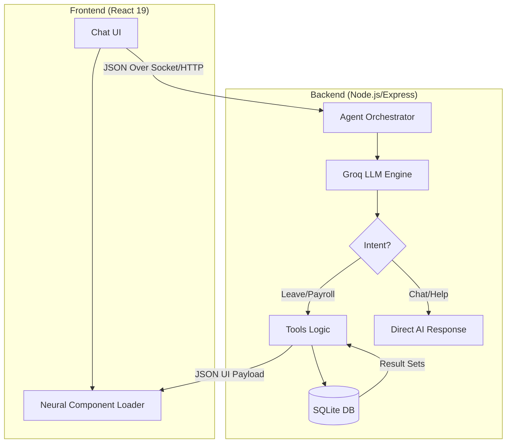
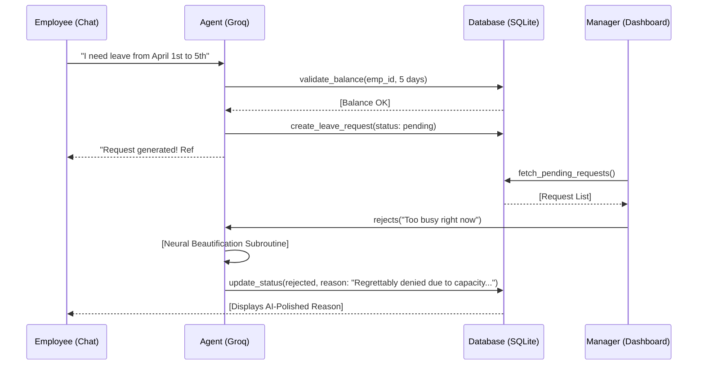
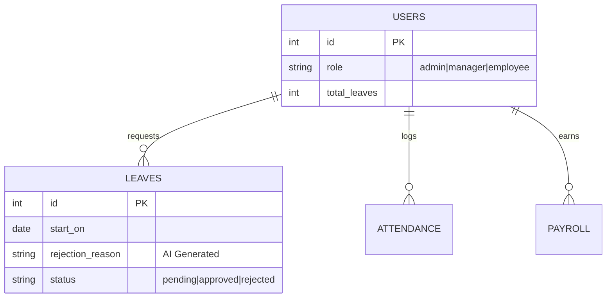

  <h1>🧠 Agentic HRMS</h1>
  
<strong>Next-Generation Autonomous Human Resource Management System powered by Groq LLMs.</strong>

  
  
  
  
  

---

## 🚀 Overview
**Agentic HRMS** fundamentally replaces traditional, form-heavy HR portals with a highly intelligent, **Conversational Agent Architecture**. 

Designed for scalability and operational simplicity, the system interprets employee intents and manager commands using Natural Language Processing (via **Groq Llama 3.1** models). The middleware precisely maps these conversational intents into strict parameterized tool executions, generating dynamic React User Interfaces (components) as chat responses.

By abstracting away manual database interactions and form fills, **Agentic HRMS** operates as an autonomous enterprise ecosystem for tracking attendance, managing policies, orchestrating payroll loops, and processing leave requests.

---

## 🏛️ High-Level Architecture

The system utilizes a **Multi-Agent Orchestrator** pattern where the LLM acts as the central router between the Chat UI and the transactional Database.

---

## 🤝 Core Workflow: Leave Approval
This diagram illustrates the lifecycle of a leave request, from the neural intent detection to the AI-driven "Empathy Layer" which polishes managerial feedback.

---

## 🌟 Key Features
- **🔮 Conversational Intelligence Layer:** Completely form-less ecosystem. Users converse naturally: *"I need leave starting tomorrow for 3 days."*
- **🛡️ Multi-Role Agent Profiles:** Contextualized security domains mapping distinctly to `Employees`, `Managers`, and `Admins`. Restricts unauthorized tool boundaries organically.
- **📈 Live Neural Dashboards:** React UI intrinsically bound to aggregate backend DB statistics, generating real-time payroll burn rates, team attendance percentages, and localized leave caps. 
- **⚖️ AI-Beautification Subroutines:** Intercepts manager UI rejections before database insertion, automatically routing curt text through a Groq-powered "Empathy Module" to render professional HR corporate outputs.
- **🛑 Strict Mathematical Overrides:** Protects against LLM hallucination and user discrepancy by independently forcing strict programmatic validation over requested leave days against hard SQLite `total_leaves` pools.

---

## 🧊 Data Architecture (ERD)
The database focuses on strict relational integrity to ensure the AI Agent never hallucinates sensitive cross-departmental data.

---

## 🛠️ Technology Architecture
| Layer | Tech Stack | Responsibility |
| :--- | :--- | :--- |
| **Frontend UI** | React 19, Vite, Tailwind v4, Framer Motion | Dynamic Glassmorphism styling, native JSON payload to `Component` injection. |
| **Backend REST** | Node.js, Express, JWT, CORS | Identity verification, direct manual UI endpoint fallbacks. |
| **Agent Middleware**| Groq SDK (`llama-3.1-8b-instant`), JS Engine | Intent interpretation, tool-routing logic, user context mapping. |
| **Database** | SQLite3 (`better-sqlite3`) | Live transactional SQL pooling and schema preservation. |

---

## 📚 Comprehensive Documentation
To dive deep into the specific architecture and implementation decisions behind this platform, check out our comprehensive documentation:

1. [**Product Requirements Document (PRD)**](./PRD.md) - The original scope and feature roadmap.
2. [**System Architecture & Diagrams**](./SYSTEM_ARCHITECTURE.md) - Deep dive into database schemas and Mermaid flowcharts of the backend logic.
3. [**Agent Orchestration Model**](./AGENT_ORCHESTRATION.md) - Analysis of our custom multi-tool Generative AI abstraction boundary.
4. [**API Contracts**](./API_CONTRACTS.md) - Documentation on the manual REST HTTP endpoints.
5. [**Installation & Deployment Guide**](./SETUP_GUIDE.md) - Developer instructions to boot the system natively.

---
> *Architected for scalable enterprise deployment by [Ammar Raza](https://github.com/ammarraza1199).*

