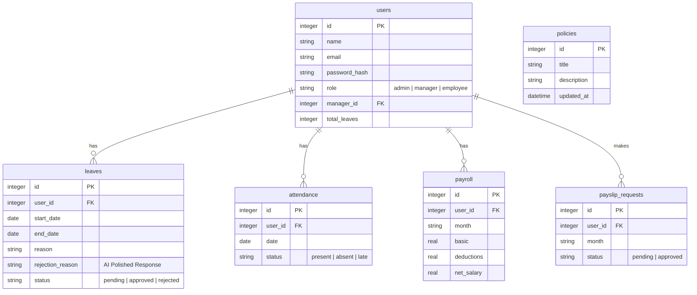
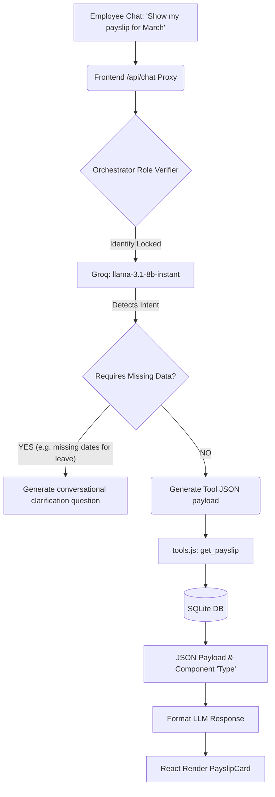

# System Architecture

The **Agentic HRMS** operates on a modular pattern separating raw UI rendering from neural data orchestration. This document formalizes the integration points connecting the SQLite layer natively up to the React 19 Client interface.

## 🛠️ Data Flow Pipeline
Unlike traditional monolithic SPAs fetching arrays of objects directly via predefined `GET /api/*` queries, our conversational layer introduces an **Intent Detection API (Orchestrator)**. 

When a user initiates a command:
1. The **React UI** builds context (Local History, JWT Role) and fires it seamlessly to the `/api/chat` node runtime. 
2. The **Groq Engine** intelligently scans over `tools.js` schemas, verifying internal parameter matching. 
3. If syntactically validated by LLM execution criteria, the Engine constructs JSON `Arguments` to map specific server-side JS functions (i.e. `get_pending_leaves`). 
4. At this juncture, the Server hard-intercepts specific authentication params preventing LLM hallucination and securing contextual bounds on data access constraints. 
5. SQLite execution succeeds, returning JSON formatted datasets to the AI Agent. The engine wraps it in conversation, formatting it under a discrete `Component Type Identifier`.
6. The frontend renders discrete components dependent exactly on the native JSON shape inside a `Switch` block (`ChatBubble.jsx`).

 

## 🧊 Database Schema Representation
SQLite (`hrms_v3.db`) dictates six strict relational tables enforcing data integrity. 

## 🔄 AI Orchestrator Layer Logic

## 🧠 Model Specifications
- **Model Framework:** `llama-3.1-8b-instant` through **Groq**. 
- **Tooling Execution Pattern:** Native JSON mapping via standard OpenAI-compatible completions format.
- **Latency Targeting:** < 500ms API response envelope on LLM execution layers.
- **Context Injection:** Strict system prompting bounding the model timeline explicitly to `2026` to match hardcoded generic seed data sets.
